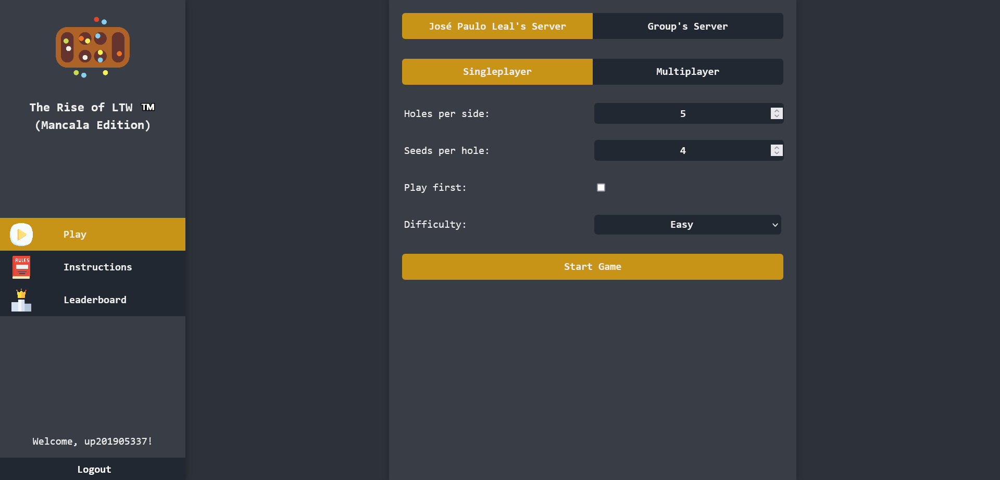
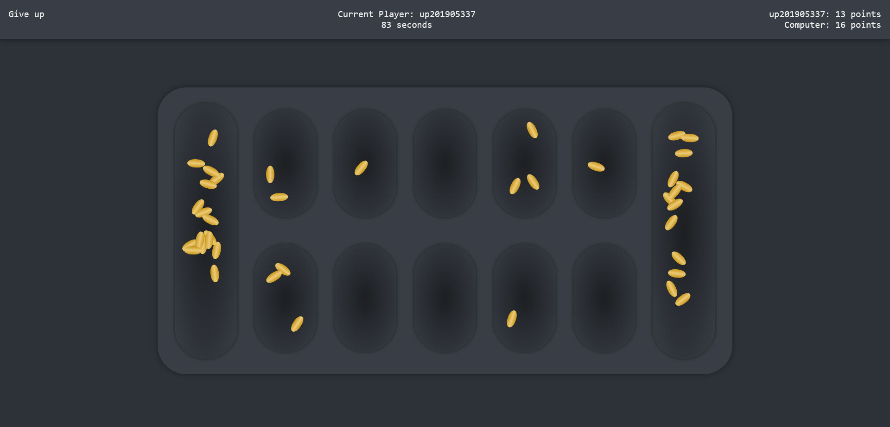

# The Rise of LTW (Mancala Edition)

## Membros

1. Francisco Cerqueira (up201905337@up.pt)
2. Vasco Alves (up201808031@up.pt)

## Descrição

O objectivo deste trabalho é o desenvolvimento de uma aplicação web em todas as suas vertentes.

O trabalho será dividido em três fases, correspondendo à sequência de tecnologias web apresentadas nas aulas teóricas.

O trabalho consiste numa versão web do [Mancala](https://pt.wikipedia.org/wiki/Mancala).

## Primeira Parte

O jogo deve ser uma aplicação de página única (single-page application). A página deve ser dividida em varias áreas, para diferentes finalidades:

- Logotipo
- Configuração
- Comandos
- Estado
- Identificação
- Área de jogo
- Instruções
- Classificações
- Mensagens

De notar que estas áreas não terão de estar sempre visíveis, e que algumas se poderão sobrepor temporariamente a outras.

## Segunda Parte

O objetivo da segunda entrega é tornar o jogo distribuído, permitindo a participação de jogadores em diferentes computadores.

## Terceira Parte

O objetivo da terceira entrega é o desenvolvimento do servidor do jogo, replicando e substituindo o servidor usando na segunda entrega.

## Screenshots

### Menu

### Game

